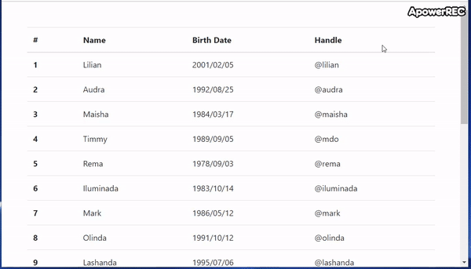

# Bootstrap Datagrid

Turn your bootstrap table into a datagrid



## Getting started
```
$ npm install goonca-bootstrap-datagrid
```
add goonca-bootstrap-datagrid.js into your page
```
<script src="goonca-bootstrap-datagrid.js" type="text/javascript"></script>
```
## Example

```javascript
<table class="table goonca-bootstrap-data-grid">
	<thead>
		<tr>
			<th data-type="number" scope="col">#</th>
			<th data-type="text" scope="col">Name</th>
			<th data-type="date" scope="col">Birth Date</th>
			<th data-type="text" scope="col">Handle</th>
		</tr>
	</thead>
	<tbody>
		<tr>
			<th scope="row">1</th>
			<td>Lilian</td>
			<td>2001/02/05</td>
			<td>@lilian</td>
		</tr>
		<tr>
			<th scope="row">2</th>
			<td>Audra</td>
			<td>1992/08/25</td>
			<td>@audra</td>
		</tr>
	</tbody>
</table> 
```
